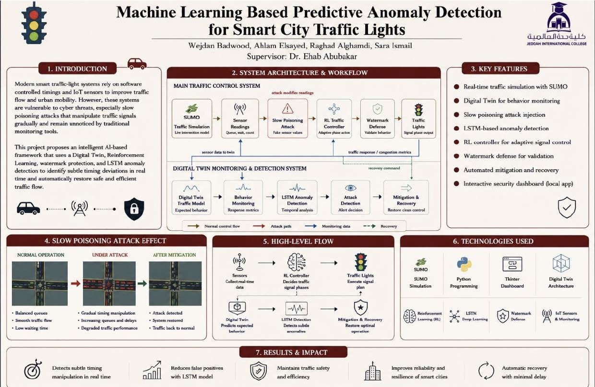
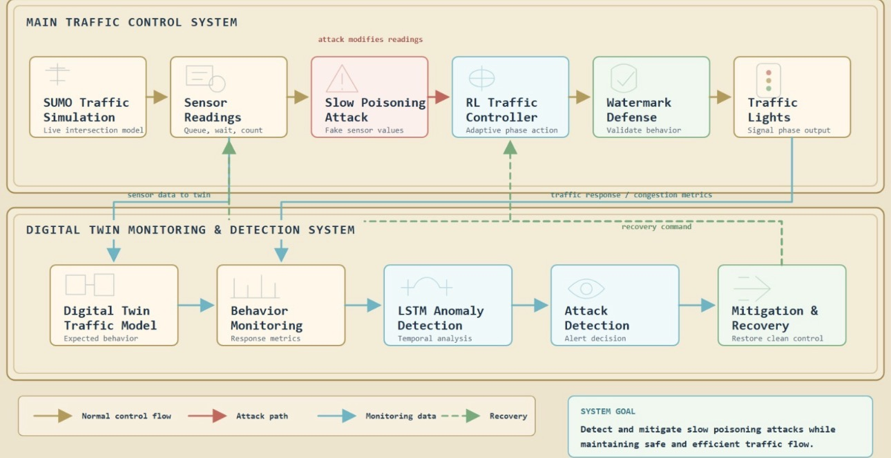
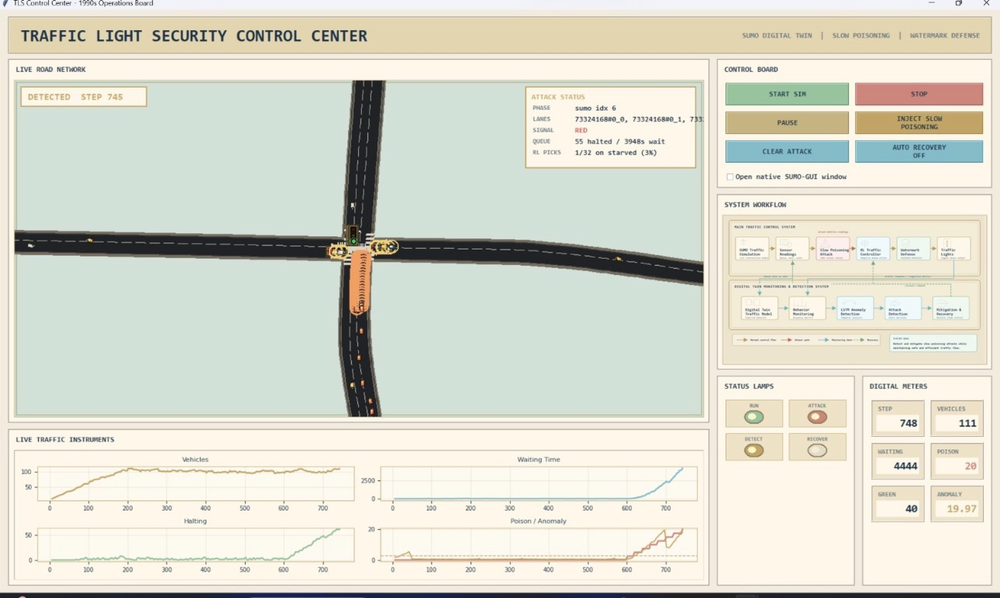
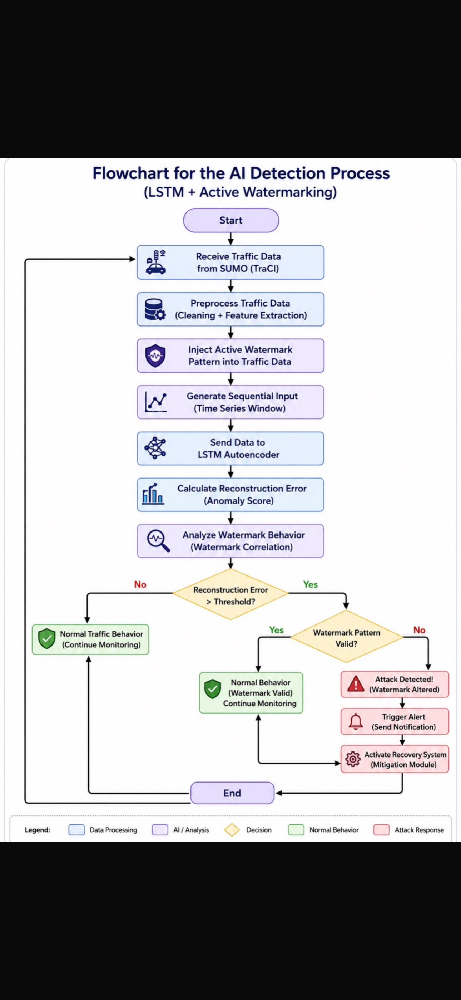

# Smart Traffic Anomaly Detection

## Overview

This project presents a machine learning-based anomaly detection system designed to protect smart city traffic lights from slow data poisoning attacks.

The proposed solution combines an LSTM Autoencoder with a Digital Twin architecture to continuously monitor traffic behavior, detect abnormal patterns in real time, and support rapid recovery to maintain efficient and reliable traffic operations.

---

## System Architecture

The system integrates traffic simulation, AI-based anomaly detection, Digital Twin monitoring, and mitigation mechanisms into a unified architecture capable of detecting and responding to cyberattacks affecting smart traffic lights.

---

## Dashboard

A custom monitoring dashboard was developed to visualize the live traffic simulation, system status, anomaly detection results, traffic metrics, and recovery process through an interactive interface.

---

## Workflow

The workflow begins with collecting traffic data from the SUMO simulator, preprocessing the data, applying watermark validation, generating sequential inputs for the LSTM Autoencoder, detecting anomalies, and automatically initiating the recovery process whenever an attack is detected.

---

## Technologies Used

- Python
- TensorFlow
- Keras
- SUMO
- OMNeT++
- LSTM Autoencoder
- Machine Learning
- Deep Learning
- Digital Twin
- Reinforcement Learning

---

## Key Features

- Real-time anomaly detection
- Slow data poisoning attack detection
- Digital Twin monitoring
- LSTM Autoencoder model
- Smart traffic simulation using SUMO
- Interactive monitoring dashboard
- Automatic mitigation and recovery
- AI-powered traffic monitoring

---

## Project Highlights

- 🏆 Selected among the **Top 5 Graduation Projects**
- 🤖 AI-based cybersecurity solution for smart traffic systems
- 🚦 Intelligent traffic monitoring and anomaly detection
- 📊 Interactive real-time visualization dashboard

---

## Repository Notice

The source code is not publicly available.

This repository is intended to showcase the project overview, system architecture, workflow, dashboard, technologies, and project outcomes.
